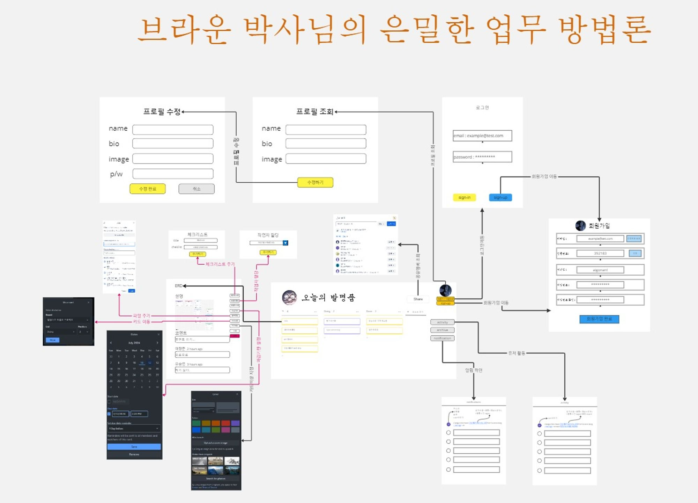
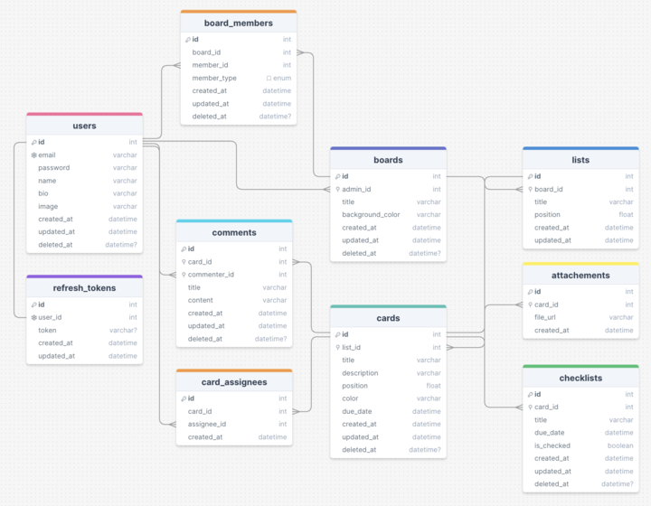

<p align="center">
  
</p>

# 내이름은코난탐정2조의 [웹 서버] 트렐로 프로젝트 

## 프로젝트 소개

칸반보드 기반 Trello같은 프로젝트 협업 도구 서비스

## 팀소개

팀장 : 🕵️여창준<br>
팀원 : 🕵🏻조영진<br>
팀원 : 🕵🏼‍♀️김현민<br>
팀원 : 🕵🏼‍♀️이현우<br>
팀원 : ☕김진서<br>
팀원 : 🕵🏿‍♂️조규민

## 주요 기능

### Auth (인증)

- 회원가입
- 로그인
- 로그아웃
- 토큰 재발급
- 이메일 인증번호 발송
- 이메일 인증번호 검증

### User (사용자)

- 프로필 조회
- 프로필 수정
- 비밀번호 수정
- 프로필 수정 (image 업로드)

### Board (보드)

- 보드 생성
- 보드 목록 조회
- 보드 상세 조회
- 보드 수정
- 보드 삭제
- 보드 멤버 초대
- 보드 멤버 초대 수락

### List (리스트)

- 리스트 생성
- 리스트 수정
- 리스트 이동
- 리스트 삭제

### Card (카드)

- 카드 생성
- 카드 상세 조회
- 카드 수정
- 카드 이동
- 카드 삭제
- 카드 담당자 추가
- 카드 담당자 삭제
- 카드 체크리스트 추가
- 카드 체크리스트 체크
- 카드 체크리스트 수정
- 카드 체크리스트 삭제
- 댓글 생성
- 댓글 수정
- 댓글 삭제
- 카드 첨부 파일 전체 조회
- 카드 첨부 파일 업로드
- 카드 첨부 파일 삭제
- 카드 첨부 파일 다운로드

### 와이어 프레임



## ERD



## API 명세서

## 기술 스택

### Programming Languages & Frameworks


### Editor & Tester


### Infrastructure / Add-On / Database


### Communication


## 패키지 설치

```bash
$ npm install
```

## 실행 방법

```bash
# 서버 실행(배포용)
$ npm run start

# 서버 실행(개발용)
$ npm run start:dev
```

## 테스트

```bash
# 테스트 실행
$ npm run test

# 테스트 커버리지 확인
$ npm run test:cov
```
